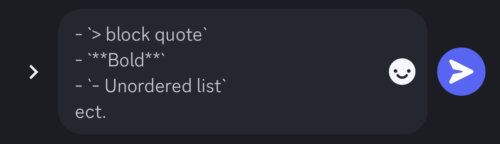
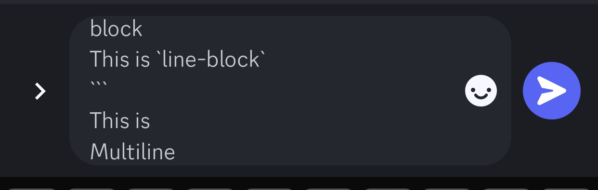

# Athoring Pulic Documents

This is intended to be a resource for making public documents from GitHub, to Markdown, to licensimg. I don't plan to change this much after it is writtem and toyed with putting it on codepen—however—i wanted to keep it on GitHub to reduce the number of sites visited to get started.

# What Is Git?

Git is a Version Control System (VCS) that snapshots data during a commit. Think of every commit as a save state: you give it a human readable message so everyone knows what you did, and it makes a uuid to fall back to. I've used it daily since 2012.

If someone goes in and deletes everything, you just revert the project back to an earlier commit before they went and deleted everything. No harm done

## How Do I Git
git VCS has several commands that are obscured by the gui I'll recommend (GitHub Desktop): **clone** (copy the project), **commit** (make a snapshot), **push** (make your changes live), and **pull** (get the remote changes). 

## Why Change
Google docs start to chug and consume a lot of memory when they reach a certain word count. MS Word has a lot of stuff that I never use. Markdown lets you save as plain text (instead of XML), and still get things like titles, subtitles, bold, italic, underline, ect.

## Markdown?
Markdown does have a few tricks like H1 (title) can be `# title` or 
```md
Title
====
```

Discord uses Markdown 
# Hello Wold
I am paragraph text

 

- `> block quote`
- `**Bold**`
- `- Unordered list`
ect.



Three for muti-line, one for line-block
This is `line-block`
```
This is
Multiline
Look at my horse
My horse is amazing...
```

 

Readme files use Markdown because once you know the rules it's easy to read, easy to write, and saves easily. It has a very small file size so it loads fast.

----

## Licensing 

When making public documents you'll want to license it under the Creative Commons license
